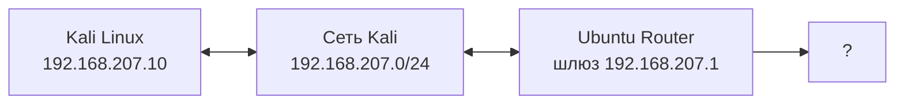
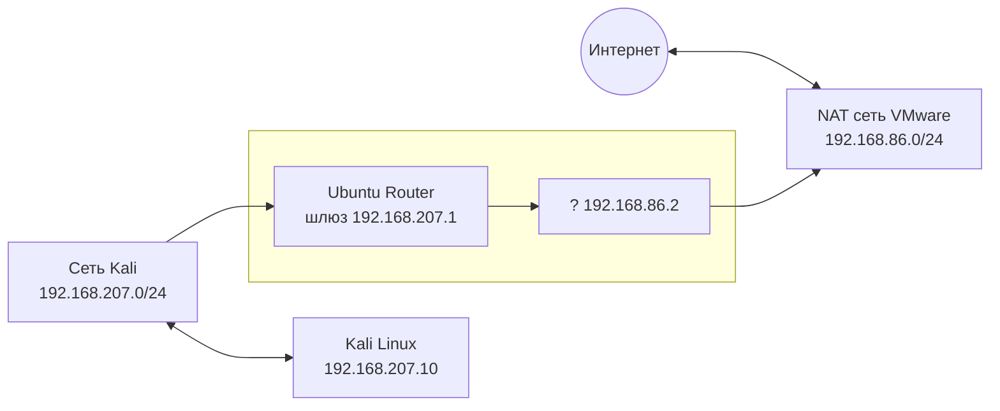
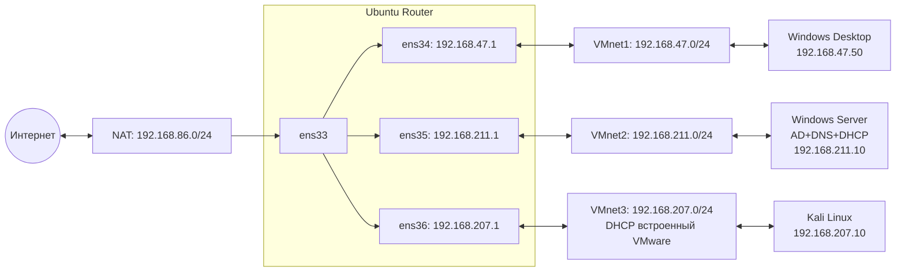

## Разведка сети c Kali

Выполняем:

```bash
ip addr show
ip route
```


```bash
cat /etc/resolv.conf
```


После выполнения команд получаем результат:

- Свой IP: 192.168.207.10/24
- Шлюз по умолчанию: 192.168.207.1
- DNS-сервер: 192.168.207.1



**Трассировка до внешних узлов**

```bash
traceroute -n 8.8.8.8
ping 8.8.8.8
```


Выводы из traceroute и ping:

- Первый hop 192.168.207.1 – шлюз (Ubuntu Router).
- Второй hop 192.168.86.2 – шлюз в сети NAT(интернет-выход). 
- Ping до 8.8.8.8 успешен, значит, маршрутизация и NAT работают.



**Обнаружение живых хостов**
```bash
fping -a -g 192.168.0.0/16 2>/dev/null | sort -t . -k 3,3n -k 4,4n > fping.txt
```
- fping – утилита для массового пингования.
- -a – показывать только отвечающие хосты.
- -g – генерировать диапазон адресов (от 192.168.0.1 до 192.168.255.254).
- 2>/dev/null – скрыть сообщения об ошибках (недоступные хосты).
- sort -t . -k 3,3n -k 4,4n – сортировка (группирования по подсетям /24).
- fping.txt – сохранить результат в файл.


**Проверка пинга до машин**

```bash
ping -c 4 192.168.203.1
ping -c 4 192.168.211.10
ping -c 4 192.168.47.50
```


Теперь запуск nmap -sn для обнаружения всех узлов в трёх подсетях:

```bash
sudo nmap -sn 192.168.47.0/24
sudo nmap -sn 192.168.211.0/24
sudo nmap -sn 192.168.203.0/24
```


- **Подсеть LAN (192.168.47.0/24)** :
  Обнаружено 3 активных узла:
  *   192.168.47.1 (роутер)
  *   192.168.47.50 (Windows Desktop)
  *   192.168.47.51 (неизвестное устройство)

- **Подсеть NET (192.168.211.0/24)** :
  Обнаружено 2 активных узла:
  *   192.168.211.1 (роутер)
  *   192.168.211.10 (Windows Server)

- **Подсеть KALI (192.168.203.0/24)** :
  Обнаружено 2 активных узла:
  *   192.168.203.1 (роутер)
  *   192.168.203.50 (Kali)

 ## Сканирование портов с определением версий

```bash
 # Windows Server
sudo nmap -sV -O -p- 192.168.211.10 -oA /home/kali/Desktop/server_full_scan
# Windows Desktop
sudo nmap -sV -O -p- 192.168.47.50 -oA /home/kali/Desktop/desktop_full_scan
```
**Флаги**:
- sV — версии служб.
- O — определение ОС.
- p- — все порты (1–65535).
- oA — сохранить результаты в трёх форматах.


### Таблица открытых портов и служб (Windows Server, 192.168.211.10)

| Порт | Состояние | Служба | Версия / примечание |
|------|-----------|--------|---------------------|
| 53/tcp | open | domain | Simple DNS Plus |
| 88/tcp | open | kerberos-sec | Microsoft Windows Kerberos |
| 135/tcp | open | msrpc | Microsoft Windows RPC |
| 139/tcp | open | netbios-ssn | Microsoft Windows netbios-ssn |
| 389/tcp | open | ldap | Microsoft Windows Active Directory LDAP (lab.local) |
| 445/tcp | open | microsoft-ds? | SMB |
| 464/tcp | open | kpasswd5? | Смена пароля Kerberos |
| 593/tcp | open | ncacn_http | Microsoft Windows RPC over HTTP 1.0 |
| 636/tcp | open | tcpwrapped | LDAP over SSL |
| 3268/tcp | open | ldap | Microsoft Windows Active Directory LDAP |
| 3269/tcp | open | tcpwrapped | LDAP over SSL |
| 5357/tcp | open | http | Microsoft HTTPAPI httpd 2.0 (SSDP/UPnP) |
| 5985/tcp | open | http | Microsoft HTTPAPI httpd 2.0 (WinRM) |
| 9389/tcp | open | mc-nmf | .NET Message Framing |
| 47001/tcp | open | http | Microsoft HTTPAPI httpd 2.0 (WinRM) |
| 49664–49668, 49670, 51709, 51712, 51716, 51717, 51721, 51733 | open | msrpc | Microsoft Windows RPC |
| 51708/tcp | open | ncacn_http | Microsoft Windows RPC over HTTP 1.0 |

Операционная система: Microsoft Windows Server 2022  
Hostname:** WIN-PV2912HIM2M 


### Windows Desktop (192.168.47.50)

| Порт | Состояние | Служба | Версия / примечание |
|------|-----------|--------|---------------------|
| 135/tcp | open | msrpc | Microsoft Windows RPC |
| 139/tcp | open | netbios-ssn | Microsoft Windows netbios-ssn |
| 445/tcp | open | microsoft-ds? | SMB |
| 5040/tcp | open | unknown | - |
| 7680/tcp | open | pando-pub? | Служба доставки обновлений |
| 49664/tcp | open | msrpc | Microsoft Windows RPC |
| 49665/tcp | open | msrpc | Microsoft Windows RPC |
| 49666/tcp | open | msrpc | Microsoft Windows RPC |
| 49667/tcp | open | msrpc | Microsoft Windows RPC |
| 49669/tcp | open | msrpc | Microsoft Windows RPC |
| 49670/tcp | open | msrpc | Microsoft Windows RPC |
| 49683/tcp | open | msrpc | Microsoft Windows RPC |
| 49697/tcp | open | msrpc | Microsoft Windows RPC |

**Операционная система:** Microsoft Windows 10 (1709 – 21H2)  

## Проверка на уязвимости

```bash
 # Для Windows Server
sudo nmap -sV --script vuln 192.168.211.10 -oN /home/kali/Desktop/server_vuln.txt
# Для Windows Desktop
sudo nmap -sV --script vuln 192.168.47.50 -oN /home/kali/Desktop/desktop_vuln.txt
```
- script vuln – запускает все скрипты, проверяющие уязвимости.
- oN – сохраняет результат в читаемом текстовом формате.
## Результаты проверки на уязвимости (nmap --script vuln)

### Windows Server (192.168.211.10)

Сканирование заняло 172.44 секунды.


**Результаты:**
- **HTTP-службы - порты 5357, 5985, 47001**:
  - Уязвимостей CSRF, DOM-based XSS и stored XSS не обнаружено.
  - Сервер выдает заголовок `Microsoft-HTTPAPI/2.0`.
- **SMB (порт 445)** – результаты скриптов:
  - `smb-vuln-ms10-054` - false (уязвимость `MS10-054` (SMB remote code execution) отсутствует).
  - `smb-vuln-ms10-061` - Could not negotiate a connection: SMB: Failed to receive bytes: ERROR ().
  - `samba-vuln-cve-2012-1182` - не удалось согласовать соединение.
- **Другие службы**: скрипты не выявили критических уязвимостей.

---

### Windows Desktop (192.168.47.50)

Сканирование заняло 32 секунды. Проверены только SMB-службы (порты 135, 139, 445).


**Результаты:**

- `smb-vuln-ms10-054`-  false.
- `smb-vuln-ms10-061` - ошибка согласования соединения.
- `samba-vuln-cve-2012-1182` - ошибка согласования.

## Разведка DNS и LDAP

### Информация DNS-сервера Windows Server

```bash
# Проверка, какой DNS-сервер использует Kali
cat /etc/resolv.conf
# Запрос SOA-записи домена lab.local
nslookup -type=SOA lab.local 192.168.211.10
# Попытка зонной передачи
dig axfr lab.local @192.168.211.10
# Обратный запрос по IP сервера
nslookup 192.168.211.10 192.168.211.10
```


### Конфигурация DNS-клиента (Kali Linux)

Файл `/etc/resolv.conf` показывает, что система использует DNS-сервер `192.168.211.10`. Второй сервер (`192.168.86.2`) добавлен автоматически сетью VMware для обеспечения доступа в интернет.

### SOA-запись (Start of Authority) для домена `lab.local`

- origin = win-pv2912him2m.lab.local: Указывает, что основным DNS-сервером для домена является хост с именем `win-pv2912him2m.lab.local`.
- mail addr = hostmaster.lab.local: Содержит email-адрес администратора домена, заменяя символ `@` на точку.
- serial = 28: Номер версии зоны. Каждое изменение в зоне увеличивает это число, что позволяет вторичным серверам определять необходимость обновления.
- refresh = 900 (15 минут): Интервал, с которого вторичный DNS-сервер проверяет актуальность своей копии зоны.
- retry = 600 (10 минут): Интервал повторной попытки, если не удалось связаться с основным сервером.
- expire = 86400 (24 часа): Время, по истечении которого вторичный сервер перестает отвечать на запросы, если не смог обновить зону.
- minimum = 3600 (1 час): Используется для отрицательного кэширования, то есть указывает клиентам, как долго кэшировать информацию об отсутствии записи.

Запрос `dig axfr` завершился с ошибкой `Transfer failed.`(Сервер отклонил запрос)

Команда `nslookup 192.168.211.10` не нашла PTR-запись для IP-адреса сервера, о чем свидетельствует ответ `NXDOMAIN`.

### Разведка LDAP

```bash
ldapsearch -H ldap://192.168.211.10 -x -s base
```


- Сервер LDAP доступен без аутентификации для чтения корневой DSE.
- domainFunctionality: 7, forestFunctionality: 7, domainControllerFunctionality: 7 – соответствует уровню функциональности Windows Server 2022 (7 = Server 2022/2019).
- isGlobalCatalogReady: TRUE – сервер является глобальным каталогом.
- namingContexts – перечислены контексты именования: сам домен (DC=lab,DC=local), конфигурация, схема, DNS-зоны.
- dnsHostName: WIN-PV2912HIM2M.lab.local – полное DNS-имя контроллера домена.

```bash
ldapsearch -H ldap://192.168.211.10 -x -b "dc=lab,dc=local"
```


- Сервер возвращает ошибку Operations error с комментарием: «In order to perform this operation a successful bind must be completed on the connection».
- Это означает, что для чтения данных домена требуется аутентификация. Анонимный доступ запрещён.

## Сканирование с помощью enum4linux

**Проверка Windows Server**

```bash
enum4linux-ng -A 192.168.211.10 | tee enum_server_output.txt
```

- -A – выполняет все основные проверки: получение информации о домене, пользователях, группах, шарах, политике паролей, ОС, принтерах, а также проверку доступности LDAP.
- 192.168.211.10 – IP-адрес целевого Windows Server.
- | tee enum_server_output.txt – одновременно выводит результат на экран и сохраняет в файл.

Результат:
```console
ENUM4LINUX - next generation (v1.3.10)

 ==========================
|    Target Information    |
 ==========================
[*] Target ........... 192.168.211.10
[*] Username ......... ''
[*] Random Username .. 'ktqpmtkt'
[*] Password ......... ''
[*] Timeout .......... 10 second(s)

 =======================================
|    Listener Scan on 192.168.211.10    |
 =======================================
[*] Checking LDAP
[+] LDAP is accessible on 389/tcp
[*] Checking LDAPS
[+] LDAPS is accessible on 636/tcp
[*] Checking SMB
[+] SMB is accessible on 445/tcp
[*] Checking SMB over NetBIOS
[+] SMB over NetBIOS is accessible on 139/tcp

 ======================================================
|    Domain Information via LDAP for 192.168.211.10    |
 ======================================================
[*] Trying LDAP
[+] Appears to be root/parent DC
[+] Long domain name is: lab.local

 =============================================================
|    NetBIOS Names and Workgroup/Domain for 192.168.211.10    |
 =============================================================
[-] Could not get NetBIOS names information via 'nmblookup': timed out

 ===========================================
|    SMB Dialect Check on 192.168.211.10    |
 ===========================================
[*] Trying on 445/tcp
[+] Supported dialects and settings:
Supported dialects:                                                                                                                                                                         
  SMB 1.0: false                                                                                                                                                                            
  SMB 2.0.2: true                                                                                                                                                                           
  SMB 2.1: true                                                                                                                                                                             
  SMB 3.0: true                                                                                                                                                                             
  SMB 3.1.1: true                                                                                                                                                                           
Preferred dialect: SMB 3.0                                                                                                                                                                  
SMB1 only: false                                                                                                                                                                            
SMB signing required: true                                                                                                                                                                  

 =============================================================
|    Domain Information via SMB session for 192.168.211.10    |
 =============================================================
[*] Enumerating via unauthenticated SMB session on 445/tcp
[+] Found domain information via SMB
NetBIOS computer name: WIN-PV2912HIM2M                                                                                                                                                      
NetBIOS domain name: LAB                                                                                                                                                                    
DNS domain: lab.local                                                                                                                                                                       
FQDN: WIN-PV2912HIM2M.lab.local                                                                                                                                                             
Derived membership: domain member                                                                                                                                                           
Derived domain: LAB                                                                                                                                                                         

 ===========================================
|    RPC Session Check on 192.168.211.10    |
 ===========================================
[*] Check for anonymous access (null session)
[+] Server allows authentication via username '' and password ''
[*] Check for guest access
[-] Could not establish guest session: STATUS_LOGON_FAILURE

 =====================================================
|    Domain Information via RPC for 192.168.211.10    |
 =====================================================
[+] Domain: LAB
[+] Domain SID: S-1-5-21-1097475920-2121775508-2348395516
[+] Membership: domain member

 =================================================
|    OS Information via RPC for 192.168.211.10    |
 =================================================
[*] Enumerating via unauthenticated SMB session on 445/tcp
[+] Found OS information via SMB
[*] Enumerating via 'srvinfo'
[-] Could not get OS info via 'srvinfo': STATUS_ACCESS_DENIED
[+] After merging OS information we have the following result:
OS: Windows 10, Windows Server 2019, Windows Server 2016                                                                                                                                    
OS version: '10.0'                                                                                                                                                                          
OS release: ''                                                                                                                                                                              
OS build: '20348'                                                                                                                                                                           
Native OS: not supported                                                                                                                                                                    
Native LAN manager: not supported                                                                                                                                                           
Platform id: null                                                                                                                                                                           
Server type: null                                                                                                                                                                           
Server type string: null                                                                                                                                                                    

 =======================================
|    Users via RPC on 192.168.211.10    |
 =======================================
[*] Enumerating users via 'querydispinfo'
[-] Could not find users via 'querydispinfo': STATUS_ACCESS_DENIED
[*] Enumerating users via 'enumdomusers'
[-] Could not find users via 'enumdomusers': STATUS_ACCESS_DENIED

 ========================================
|    Groups via RPC on 192.168.211.10    |
 ========================================
[*] Enumerating local groups
[-] Could not get groups via 'enumalsgroups domain': STATUS_ACCESS_DENIED
[*] Enumerating builtin groups
[-] Could not get groups via 'enumalsgroups builtin': STATUS_ACCESS_DENIED
[*] Enumerating domain groups
[-] Could not get groups via 'enumdomgroups': STATUS_ACCESS_DENIED

 ========================================
|    Shares via RPC on 192.168.211.10    |
 ========================================
[*] Enumerating shares
[+] Found 0 share(s) for user '' with password '', try a different user

 ===========================================
|    Policies via RPC for 192.168.211.10    |
 ===========================================
[*] Trying port 445/tcp
[-] SMB connection error on port 445/tcp: STATUS_ACCESS_DENIED
[*] Trying port 139/tcp
[-] SMB connection error on port 139/tcp: session failed

 ===========================================
|    Printers via RPC for 192.168.211.10    |
 ===========================================
[-] Could not get printer info via 'enumprinters': STATUS_ACCESS_DENIED

Completed after 10.42 seconds
```
Анализ результата:
- LDAP и SMB доступны: Сервер отвечает на портах 389 (LDAP), 636 (LDAPS), 445 (SMB) и 139 (SMB over NetBIOS).
- Информация о домене и SID: Через LDAP и анонимную SMB-сессию мы получили имя домена lab.local, NetBIOS-имя LAB, SID домена S-1-5-21-1097475920-2121775508-2348395516.
- Анонимная (null) сессия разрешена: [+] Server allows authentication via username '' and password ''.
- Гостевая сессия запрещена: STATUS_LOGON_FAILURE – вход по гостевой учётной записи не работает.
- Поддерживаемые диалекты SMB: SMB 1.0 отключён, SMB 2.0.2, 2.1, 3.0, 3.1.1 включены. Подпись SMB обязательна (SMB signing required: true).
- Попытки получить пользователей, группы, шары, политику паролей и принтеры завершились ошибкой STATUS_ACCESS_DENIED. Это говорит о том, что даже при наличии анонимной сессии контроллер домена настроен так, чтобы не раскрывать эти сведения неавторизованным пользователям. Такая политика соответствует стандартным рекомендациям безопасности для Active Directory.
- Информация об ОС: Определена версия 10.0 и сборка 20348. Точное название не удалось из-за ограничений доступа.
- Запрос политики паролей также был отклонён. Это означает, что анонимному пользователю запрещено читать политику паролей через RPC. Для получения такой информации потребуются учётные данные доменного пользователя.

## Проверка Windows Dekstop
```bash
enum4linux-ng -A 192.168.47.50 | tee enum_desktop_output.txt
```

```cmd
netsh advfirewall set allprofiles state off
```

Результат при выключённом брандмауэре:
```console
NUM4LINUX - next generation (v1.3.10)

 ==========================
|    Target Information    |
 ==========================
[*] Target ........... 192.168.47.50
[*] Username ......... ''
[*] Random Username .. 'jiomvoud'
[*] Password ......... ''
[*] Timeout .......... 10 second(s)

 ======================================
|    Listener Scan on 192.168.47.50    |
 ======================================
[*] Checking LDAP
[-] Could not connect to LDAP on 389/tcp: connection refused
[*] Checking LDAPS
[-] Could not connect to LDAPS on 636/tcp: connection refused
[*] Checking SMB
[+] SMB is accessible on 445/tcp
[*] Checking SMB over NetBIOS
[+] SMB over NetBIOS is accessible on 139/tcp

 ============================================================
|    NetBIOS Names and Workgroup/Domain for 192.168.47.50    |
 ============================================================
[-] Could not get NetBIOS names information via 'nmblookup': timed out

 ==========================================
|    SMB Dialect Check on 192.168.47.50    |
 ==========================================
[*] Trying on 445/tcp
[+] Supported dialects and settings:
Supported dialects:
  SMB 1.0: false
  SMB 2.0.2: true
  SMB 2.1: true
  SMB 3.0: true
  SMB 3.1.1: true
Preferred dialect: SMB 3.0
SMB1 only: false
SMB signing required: false

 ============================================================
|    Domain Information via SMB session for 192.168.47.50    |
 ============================================================
[*] Enumerating via unauthenticated SMB session on 445/tcp
[+] Found domain information via SMB
NetBIOS computer name: DESKTOP-3FF8NA4                                                                                                                                                      
NetBIOS domain name: LAB                                                                                                                                                                    
DNS domain: lab.local                                                                                                                                                                       
FQDN: DESKTOP-3FF8NA4.lab.local                                                                                                                                                             
Derived membership: domain member                                                                                                                                                           
Derived domain: LAB                                                                                                                                                                         

 ==========================================
|    RPC Session Check on 192.168.47.50    |
 ==========================================
[*] Check for anonymous access (null session)
[-] Could not establish null session: STATUS_ACCESS_DENIED
[*] Check for guest access
[-] Could not establish guest session: STATUS_LOGON_FAILURE
[-] Sessions failed, neither null nor user sessions were possible

 ================================================
|    OS Information via RPC for 192.168.47.50    |
 ================================================
[*] Enumerating via unauthenticated SMB session on 445/tcp
[+] Found OS information via SMB
[*] Enumerating via 'srvinfo'
[-] Skipping 'srvinfo' run, not possible with provided credentials
[+] After merging OS information we have the following result:
OS: Windows 10, Windows Server 2019, Windows Server 2016                                                                                                                                    
OS version: '10.0'                                                                                                                                                                          
OS release: '2004'                                                                                                                                                                          
OS build: '19041'                                                                                                                                                                           
Native OS: not supported                                                                                                                                                                    
Native LAN manager: not supported                                                                                                                                                           
Platform id: null                                                                                                                                                                           
Server type: null                                                                                                                                                                           
Server type string: null                                                                                                                                                                    

[!] Aborting remainder of tests since sessions failed, rerun with valid credentials

Completed after 10.12 seconds
```
Анализ результата:
- LDAP недоступен – клиентская рабочая станция не является контроллером домена, поэтому порты 389/636 закрыты.
- SMB доступен на портах 445 и 139 – это необходимо для работы сетевых папок и удалённого управления. Брандмауэр отключён, поэтому соединение установилось.
- SMB signing required: false – критическое отличие от сервера. На рабочей станции не требуется подпись SMB, что делает её уязвимой для атак ретрансляции NTLM.
- Анонимная (null) сессия запрещена – STATUS_ACCESS_DENIED.
- Гостевая сессия также запрещена – STATUS_LOGON_FAILURE.
- Информация об ОС получена через неаутентифицированный SMB – удалось определить версию 10.0, сборку 19041.
- Все остальные проверки (пользователи, группы, шары, политика паролей) пропущены – из‑за невозможности открыть RPC‑сессию с анонимными учётными данными. Утилита выдала предупреждение: «Aborting remainder of tests since sessions failed, rerun with valid credentials».

```cmd
netsh advfirewall set allprofiles state on
```
Результат при включённом брандмауэре:
```console
ENUM4LINUX - next generation (v1.3.10)

 ==========================
|    Target Information    |
 ==========================
[*] Target ........... 192.168.47.50
[*] Username ......... ''
[*] Random Username .. 'epdyzeye'
[*] Password ......... ''
[*] Timeout .......... 10 second(s)

 ======================================
|    Listener Scan on 192.168.47.50    |
 ======================================
[*] Checking SMB
[-] Could not connect to SMB on 445/tcp: timed out
[*] Checking SMB over NetBIOS
[-] Could not connect to SMB over NetBIOS on 139/tcp: timed out

[!] Aborting remainder of tests since neither SMB nor LDAP are accessible

Completed after 20.02 seconds
```
Анализ результата:
- SMB-порты не отвечают: утилита не смогла установить TCP-соединение на порты 445 и 139 в течение тайм-аута (20 секунд).
- Брандмауэр Windows 10 блокирует входящие запросы к SMB из внешних сетей (по умолчанию разрешены только подключения из локальной подсети, но Kali находится в другой подсети 192.168.207.0/24, а рабочий стол в 192.168.47.0/24; маршрутизация работает, но брандмауэр оценивает трафик как “не из локальной сети”).
- В итоге enum4linux-ng не может продолжить сканирование и выводит сообщение об отказе.

## Bloodhound


```bash
bloodhound-python -d lab.local -u ansible -p 'Pass123!' -ns 192.168.211.10 -c All --zip
```

- bloodhound-python – утилита для сбора информации об Active Directory.
- -d lab.local – целевой домен.
- -u ansible – имя пользователя домена.
- -p 'Pass123!' – пароль пользователя.
- -ns 192.168.211.10 – DNS-сервер (контроллер домена).
- -c All – собрать все возможные типы данных: пользователи, группы, компьютеры, ACL, GPO, локальные администраторы, сессии (по возможности).
- --zip – упаковать выходные JSON-файлы в ZIP-архив.


## Схема сети


